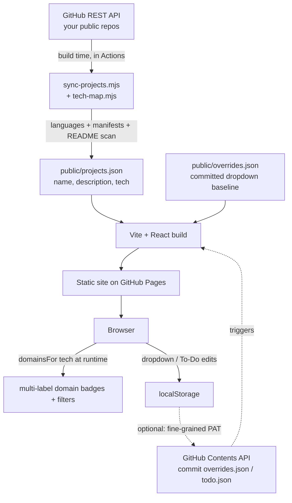

# Build Log 🚀

**A self-updating dashboard of every project I ship — repo metadata is pulled from the GitHub API at build time, so I only ever set four status dropdowns, never retype what the code already knows.**

🔗 **Live:** https://shiva-shivanibokka.github.io/build-log/

> ### Recruiter TL;DR
> - **What it is:** a personal engineering dashboard that auto-syncs *all* my public GitHub repos (name, description, categorized tech stack, and an AI/ML *field* classification) into one board, plus a second board for tracking project ideas.
> - **Hardest problem solved:** deriving a clean, categorized tech stack and a multi-label domain classification (Agentic, LLMs & GenAI, Computer Vision, MLOps, …) for 50+ repos *automatically* from heterogeneous signals — GitHub languages, dependency manifests, and README keyword scans — with zero per-repo manual tagging.
> - **Runs itself:** a scheduled GitHub Actions pipeline re-syncs the data and redeploys with no human in the loop; new repos appear on their own.

---

## Overview — why this exists

I build a lot of small projects, and I kept losing track of which ones were finished, which were posted to LinkedIn, which still needed a write-up, and what each one was actually built with. A spreadsheet went stale immediately because it required manual data entry for information that *already lives in the repos themselves*.

**Build Log flips that around:** the objective facts about a project (its name, description, and tech stack) are read straight from GitHub, and I'm only responsible for the subjective status I can't derive from code — is it done, is it posted, does it need a revamp. It's built as a portfolio piece and a genuinely-used personal tool: a live, always-current index of my work that I can point recruiters at.

## Features

- **Zero-entry project sync** — lists every public repo I own and, for each, derives the description (repo description → README intro fallback) and a **categorized tech stack** (Frontend / Backend / Data / etc.). Create a new repo and it appears on the next sync.
- **Automatic AI/ML domain classification** — each repo is multi-labeled into *field* domains (Agentic, LLMs & GenAI, Deep Learning, NLP, Computer Vision, MLOps, Classical ML, Data Science, SWE/Full-Stack) derived from its detected tech, and the board can be filtered by domain.
- **Four status dropdowns I control** — GitHub posted? · LinkedIn posted? · Status (Done / In-progress / Pending / Yet-to-start / **Revamp**) · What & Why write-up status. Each is color-coded.
- **A second "To Do" board** — a backlog of project ideas with Implemented?, Priority, Domain, Proposed tech, and Notes.
- **Optional GitHub write-back** — paste a fine-grained token in Settings and dropdown/idea edits commit straight back to the repo (debounced); without a token, a one-click backup downloads the JSON.
- **Live, animated dark UI** — Orbitron display type, an animated circuit-board canvas background, neon glass cards, and a per-status stat strip.

## Architecture

The core design decision is a **build-time data pipeline + a thin client**, rather than a runtime backend. The site is fully static (GitHub Pages); the only "server" work happens inside GitHub Actions at build time. This keeps hosting free, removes a backend to maintain, and means the data is a plain committed JSON file.



**Why this shape:**
- **Build-time sync over a runtime API call** — the GitHub token stays in the CI secret, never shipped to the browser; the client just reads a static JSON, so it's fast and can't leak credentials.
- **Committed JSON as the database** — `projects.json` (auto) and `overrides.json` (manual) are the entire data layer. No DB to run, and the data is diffable in git.
- **Local-first edits with optional write-back** — dropdown changes apply instantly in `localStorage`; the optional PAT path commits them via the Contents API so they persist across devices, without ever putting a server in the loop.

## Tech Stack

Read from `package.json`:

| Layer | Choice | Notes |
| --- | --- | --- |
| Build | **Vite 5** | fast dev + static build for GitHub Pages (`base: '/build-log/'`) |
| UI | **React 18 + TypeScript 5** | typed components; strict mode on |
| Styling | **Tailwind CSS 3** | custom dark neon palette + Orbitron/Space Grotesk/JetBrains Mono |
| Sync | **Node (ESM) script** | `fetch` against the GitHub REST API; no runtime deps |
| CI/CD | **GitHub Actions → Pages** | sync → build → deploy on push, weekly cron, and manual dispatch |

## Skills Demonstrated

- **Build-time data engineering** — designing an ETL-style pipeline that reconciles heterogeneous sources (languages API, dependency manifests, README text) into one normalized, categorized dataset.
- **Automated classification** — a rules-based multi-label classifier mapping detected tech → AI/ML field domains, applied client-side.
- **CI/CD automation** — a self-scheduling GitHub Actions pipeline (cron + push + manual) that regenerates data and redeploys with no manual step.
- **Frontend engineering** — React + TypeScript + Tailwind, custom portal-rendered dropdowns, canvas animation, `localStorage` state with an optional remote-commit sync layer.
- **Secure secrets handling** — keeping the sync token in CI only; the optional user PAT lives solely in the browser and is never committed or transmitted anywhere but GitHub's API.

## Getting Started

```bash
npm install
npm run sync     # generate public/projects.json from GitHub
npm run dev      # start the dashboard locally
```

`npm run sync` uses the GitHub REST API. Unauthenticated it's limited to 60 req/hr and writes a lighter dataset; for a full pass (README + manifest enrichment) export a token first:

```bash
GITHUB_TOKEN=ghp_xxx npm run sync
```

The tracked account is set in `scripts/sync-projects.mjs` (`OWNER`), which also lists the repos to skip (profile-readme repo and the tracker repos themselves).

## Usage

- **Projects tab** — browse/search/sort all repos; filter by status or domain; set the four dropdowns per card.
- **To Do tab** — add project ideas and set Implemented / Priority / Domain / Proposed tech / Notes.
- **Persisting edits** — click **Save / Back up** to download the overrides JSON and commit it, *or* add a fine-grained PAT (Contents: read & write on this repo only) in **⚙ Settings** to have edits auto-commit.

Adding a new tech to the detector requires no app code — just edit the dictionaries in `scripts/tech-map.mjs`.

## Project Structure

```
scripts/
  sync-projects.mjs    # GitHub REST API → public/projects.json (runs in CI)
  tech-map.mjs         # detection dictionaries (languages, packages, keywords, file signals)
public/
  projects.json        # generated auto data (name, description, tech)
  overrides.json       # committed dropdown baseline (manual data)
  todo.json            # committed To-Do board data
src/
  App.tsx              # header, tabs, save/settings wiring
  components/
    ProjectsView.tsx   # projects board: stat strip, filters, grid
    ProjectCard.tsx    # one repo: domain badges, tech stack, dropdowns
    TodoView.tsx       # the To-Do board
    CircuitBackground.tsx  # animated canvas background
    DomainSelect / Select / Pill / TechStack / StatStrip / SettingsModal
  lib/
    store.ts           # load + merge (baseline + local) + localStorage + sync
    todos.ts           # To-Do state + sync
    domains.ts         # tech → multi-label AI/ML domain classifier
    dropdowns.ts       # dropdown definitions + tones
    github.ts          # optional Contents-API write-back (user PAT)
  data/types.ts
.github/workflows/deploy.yml   # sync → build → deploy to Pages
```

## Testing

There is **no automated test suite** at this time — this is a single-user portfolio dashboard, and correctness is currently verified manually against the live GitHub data. The build does run `tsc` in strict mode (`npm run build` / `npm run lint`), so type errors fail the build. Adding unit tests for the tech-detection and domain-classification logic (the parts with real branching logic) is the most valuable next testing step.

## Deployment

Deployed to **GitHub Pages** via the `Build & Deploy` GitHub Actions workflow (`.github/workflows/deploy.yml`): it runs the sync (authenticated with the repo's `GITHUB_TOKEN`), builds with Vite, and publishes `dist/`. It triggers on push to `main`, on a **weekly cron** (to pick up new repos), and via **manual dispatch** (the "Run workflow" button, to force an immediate re-sync). Live at https://shiva-shivanibokka.github.io/build-log/.

## Impact / Results

This is a personal tool, so I'm not going to invent usage metrics. Qualitatively:

- It replaced a manually-maintained spreadsheet that went stale constantly; project metadata is now **never hand-entered** — it's derived from the source of truth (the repos).
- It currently tracks **53 public repositories** with auto-derived tech stacks and domain labels, updated on a schedule with no manual step.

## Roadmap / Future Work

- Unit tests for the tech-detection and domain-classification logic.
- Optionally surface stars / last-pushed trends over time.
- Pull in private repos behind the user's own token (currently public-repos only).

## License

No license file yet — treat as all-rights-reserved / personal project unless a `LICENSE` is added.
